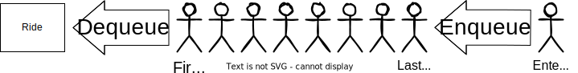
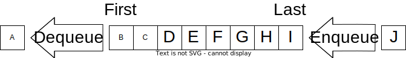

# Queues

## Introduction

Queues are distinguished by their *first in, first out* or "FIFO" data access.
We see examples of FIFO in real life, most commonly in the forms of lines of people.
Another way to think of it is "first come, first served".
In the realm of computing, queues are using to preserve the order of data.
For example, when a computer is requesting data from an external device, it can't process
it all at once; keeping bytes in their proper order is important so that data isn't
corrupted.

## Diagram

Let's first look at a more abstract example of a queue using a line at an amusement park:



As we see, when a ride is ready for new riders, it *dequeues* that many riders out
of the front of the line to get on the ride. When a new rider enters the back of the
line, the rider is *enqueued*.

Let's see a second, less abstract abstract example of using a queue to preserve the
order of the alphabet:



Notice how the queue preserves the order when enqueuing and dequeuing.

## Performance

| Common Queue Operation |                        Description                       |    Performance   |
|:----------------------:|:--------------------------------------------------------:|:----------------:|
| enqueue(value)         | Adds "value" to the back of the queue                    | O(1)             |
| dequeue()              | Removes and returns the item from the front of the queue | O(n) or O(1)[^1] |
| size()                 | Returns the size of the queue                            | O(1)             |
| empty()                | Returns true if the length of the queue is zero.         | O(1)             |

[^1]: Performance is only O(n) time if the backing data structure is an array.
Other backing structures, such as linked lists, can return values more efficiently.

## Example - Amusement park line

Let's take the example provided earlier and apply it to a code example.

```python
# Amusement park line example

# Make a queue for a line with people in it
ride_line = Queue(['Rider 1', 'Rider 2', 'Rider 3', 'Rider 4', 'Rider 5', 'Rider 6', 'Rider 7', 'Rider 8'])

# A new rider entered the end of the line
ride_line.enqueue('Rider 9')

# ['Rider 1', 'Rider 2', 'Rider 3', 'Rider 4', 'Rider 5', 'Rider 6', 'Rider 7', 'Rider 8', 'Rider 9']
print(ride_line)

# The ride finished a cycle and has 5 open seats
ride_line.dequeue()
ride_line.dequeue()
ride_line.dequeue()
ride_line.dequeue()
ride_line.dequeue()

# ['Rider 6', 'Rider 7', 'Rider 8', 'Rider 9']
print(ride_line)

# A new rider entered the end of the line
ride_line.enqueue('Rider 10')

# The ride finished a cycle and has 5 open seats
ride_line.dequeue()
ride_line.dequeue()
ride_line.dequeue()
ride_line.dequeue()
ride_line.dequeue()

# []
print(ride_line)

# True
print('Line empty:', ride_line.empty)

# Two new riders at the end of the line
ride_line.enqueue('Rider 11')
ride_line.enqueue('Rider 12')

# ['Rider 11', 'Rider 12']
print(ride_line)

# The ride finished a cycle and has 5 open seats
ride_line.dequeue()
ride_line.dequeue()
# These should not return anything but still successfully run
ride_line.dequeue()
ride_line.dequeue()
ride_line.dequeue()

# []
print(ride_line)
```

## Try it yourself - PS5 backorders

The Playstation 5 is a widely sought after game console. As such, many companies
have started paid memberships that give priority to members over others.
In this challenge, you will use multiple "tiered" queues that supersede others
whenever there are any customers in that queue.

Open the [try it yourself](src/tryit_queues.py) and complete the challenges noted in
the comments. Your output should match the comments in the tests section.

The backing structure uses [deques](https://docs.python.org/3/library/collections.html#collections.deque).
The it has convenient methods for building queues that allow both enqueue and dequeue operations to be
done in O(1) time.
