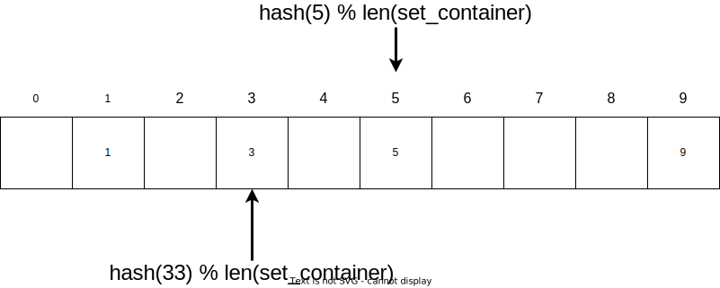

# Sets

## Introduction

Sets have two major distinctive characteristics:

1. They do not preserve any item order
2. Every item in them must be unique

Taking advantage of these characteristics, a set implementation will *hash*
an object given to it. A hash is a puesdo-unique value that can be thought
of as a distinct signiature. Because the signiatures are generally unique enough,
the hash can be manipulated to determine a static location under the hood.
When all is said and done, common operations such as adding, removing, and
checking for membership can be done in O(1) time.

### A note on Maps

A data structure that expands on sets is a Map or Dictionary. These types store
unique keys, just like a set would, and associates these keys with different data.
Maps are very common; in fact it is the basis of some general data storage formats,
such as the JSON format.

## Diagram
Behind the scenes, the backing data structure of a set is made up of an array or
list. Where the object is placed in the backing array depends on the hash of the
object being placed in the array. We can take the modulo of the hash in relation to
the length of the backing list to ensure that we do not have to enlarge the list
more than needed to accomodate a single value. (Note that the hash of an integer is
the same as the value of that integer in Python.)



What happens we try to insert a value of `55` in the set?

`hash(55) % len(set_container)` is equal to index 5 in the backing array, which
already contains a value. This causes a *conflict* that has to be resolved.

There are a couple ways to resolve this conflict. The first would be to attempt
to find the next empty index in the backing array and use it; however this method can
cause additional conflicts and isn't as robust.

Another method referred to as *chaining* can store both values in the same spot,
creating a list at the target index. If the amount of conflicts is high, this will
adversely affect performance. To combat this, the backing array size should be
changed, affecting the modulo value to be applied to the hashes.


## Preformance
| Common Set Operation |               Description              | Performance (assuming good conflict resolution) |
|:--------------------:|:--------------------------------------:|:-----------------------------------------------:|
|      add(value)      |         Adds "value" to the set        |                       O(1)                      |
|     remove(value)    |    Removes the "value" from the set    |                       O(1)                      |
|     member(value)    |   Determines if "value" is in the set  |                       O(1)                      |
|        size()        | Returns the number of items in the set |                       O(1)                      |

## Example - Grocery List
```python
```