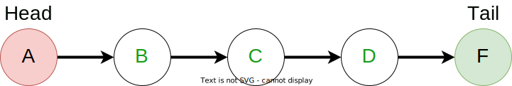
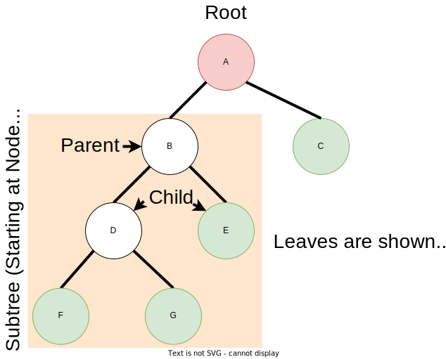
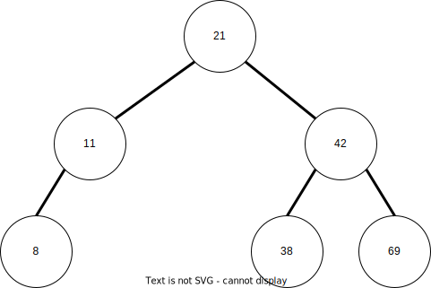
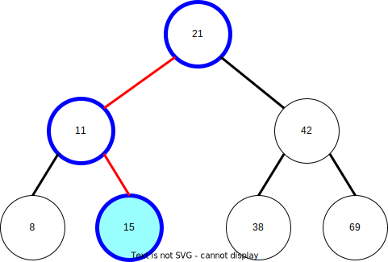

# Binary Search Trees

Binary Search Trees (BSTs) can be one of the harder data strutures to internalize.
To better understand them, we can look at other similar data structures that use individual
concepts implemented in Binary Search Trees.

## Introduction

### Nodes and Linked Lists

The most fundamental part of a tree is a *node*. Nodes are structures that contain
data as well as point to other nodes. In it's simplest form, one node can point to a
single other node to create a *linked list*.

In this diagram, we see a *head* as well as a *tail* node. The head is a node that has nothing
pointing to it and is where the linked list begins. The tail node points to nothing else and is
the end of the linked list.

### Binary Trees

Nodes don't have to just point to one different node like in a linked list. Let's say we give
a node the ability to point to two different nodes:

This difference of being able to traverse in multiple directions is the key difference between
a linked list and a *binary tree*. We see that the tree only has a single *root* node but
has several *leaf* nodes. The reason for this is the parent-child relationship found in trees.
The root node is the *parent* of all nodes in the tree. As we traverse down the tree, we go
through a *child* of that node. When a node has no children, we have hit a leaf node.

### Binary Comparison for Searches

So now that we know how we get a binary tree, where does the whole "search" aspect come from?

Let's say we have a binary tree that has been populated with values. Values lower than the data
in the current node are pushed to the left, and values higher are pushed to the right.
Duplicates, if allowed, can be put in either branch as long as it is consistent.

Let's try adding a value of **15**.

1. 15 is less than 21, so we traverse to the left child.
2. 15 is greater than 11, so we traverse to the right child.
3. We find that no child exists on the right, so we add a new node in place.

